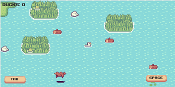

# Duckling Dash - Readme

### Overview:
Developed in a week and a half for the [Pirate Software Game Jam #14](https://itch.io/jam/pirate).
You can play the game [here](https://johnnyfriend.itch.io/dukcy-test)

### Game Description:
Your goal is to try and collect as many ducklings as you can. Explore the endless proceduraly generated map in search for ducklings!

Beware of predators and hunters!

Play around with the Tab and Space keys to try and survive and collect as many ducklings as you can.

### Credits:
Developed by [johnny](https://github.com/jonathan-ami), [pgchmp](https://johnnyfriend.itch.io/dukcy-test), and [Kyunje](https://github.com/Kyunje)

Music composed by [johnnyfriend](https://www.youtube.com/channel/UC8G27AXnD6igNNpVGhZ6rHg)


### Screenshots:



### Installation:
1. Clone this repository to your local machine.
```bash
   git clone https://github.com/jhideki/duckling-dash.git
```
2. Open the project in Unity (Version 2022.3.1 recommended).
3. Run the game in the Unity Editor or build the game for your desired platform.
